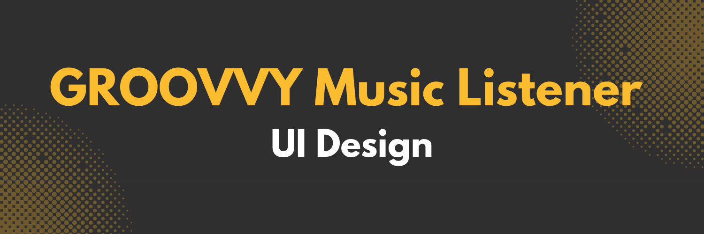

<div align="center">
  <br />
    <a href="https://youtu.be/s1u7tJ9VUh0" target="_blank">
      
    </a>
  <br />

  <div>
    
    
    
    
  </div>

  <h3 align="center">Groovvy - Music Listener</h3>

<div align="center">
     Build this project step by step with a detailed tutorial on <a href="https://www.youtube.com/@codespirit369/videos" target="_blank"><b>Code Spirit</b></a> YouTube. 
    </div>
</div>

## 📋 <a name="table">Table of Contents</a>

1. 🎬 [Introduction](#introduction)
2. ⚙️ [Tech Stack](#tech-stack)
3. 🔋 [Features](#features)
4. 🚀 [Quick Start](#quick-start)
5. 🕸️ [Snippets (Code to Copy)](#snippets)
6. 🔗 [Assets](#links)

## 🚨 Tutorial

This repository contains the code corresponding to an in-depth tutorial available on our YouTube channel, <a href="https://www.youtube.com/@codespirit369/videos" target="_blank"><b>Code Spirit</b></a>.

<a href="https://youtu.be/s1u7tJ9VUh0" target="_blank"></a>

## <a name="tech-stack">⚙️ Tech Stack</a>

- React.js
- Next.js
- Typescript
- TailwindCSS
- shadcn/ui

## <a name="introduction">🎬 Introduction</a>

Welcome to Groovvy! This UI design project focuses on building a sleek, responsive layout using shadcn/ui components. In this tutorial, we’ll cover how to use the newest shadcn/ui sidebar component to create a modern, easy-to-navigate sidebar for your web app.

## <a name="features">🔋 Features</a>

👉 **shadcn/ui Sidebar**: Learn how to integrate and customize the sidebar component from shadcn/ui.

👉 **Responsive Design**: Ensure the sidebar and layout work seamlessly across devices.

## <a name="quick-start">🚀 Quick Start</a>

Follow these steps to set up the project locally on your machine.

**Prerequisites**

Make sure you have the following installed on your machine:

- [Git](https://git-scm.com/)
- [Node.js](https://nodejs.org/en)
- [npm](https://www.npmjs.com/) (Node Package Manager)

**Cloning the Repository**

```bash
git clone https://github.com/code-spirit-369/groovvy-music-listener-ui.git
cd groovvy-music-listener-ui
```

**Installation**

Install the project dependencies using npm:

```bash
npm install
```

**Running the Project**

```bash
npm run dev
```

Open [http://localhost:3000](http://localhost:3000) in your browser to view the project.

## <a name="snippets">🕸️ Code Snippets</a>

<details>
<summary><code>/constants/index.ts</code></summary>

```typescript
import {
  AlbumIcon,
  DiscAlbum,
  FolderIcon,
  HeartIcon,
  HistoryIcon,
  LayoutDashboardIcon,
  LibraryIcon,
  ListMusicIcon,
  MicIcon,
  PlayCircleIcon,
  RadioIcon,
  SquarePlusIcon,
  Volume1Icon,
  ZapIcon,
} from "lucide-react";

export const data = {
  app: {
    name: "Groovvy",
    logo: "/logo.svg",
    version: "1.0.0",
  },
  user: {
    name: "John Doe",
    email: "johndoe@example.com",
    avatar: "/user.jpg",
  },
  navMain: [
    {
      title: "Menu",
      icon: LayoutDashboardIcon,
      url: "#",
      isActive: true,
      items: [
        {
          title: "Explore",
          icon: ZapIcon,
          url: "#",
        },
        {
          title: "Genres",
          icon: Volume1Icon,
          url: "#",
        },
        {
          title: "Albums",
          icon: DiscAlbum,
          url: "#",
        },
        {
          title: "Artists",
          icon: MicIcon,
          url: "#",
        },
        {
          title: "Radio",
          icon: RadioIcon,
          url: "#",
        },
      ],
    },
    {
      title: "Library",
      icon: LibraryIcon,
      url: "#",
      isActive: true,
      items: [
        {
          title: "Recent",
          url: "#",
          icon: HistoryIcon,
        },
        {
          title: "Albums",
          url: "#",
          icon: AlbumIcon,
        },
        {
          title: "Favourites",
          url: "#",
          icon: HeartIcon,
        },
        {
          title: "Local",
          url: "#",
          icon: FolderIcon,
        },
      ],
    },
    {
      title: "Playlists",
      icon: ListMusicIcon,
      url: "#",
      isActive: true,
      items: [
        {
          title: "Create New",
          url: "#",
          icon: SquarePlusIcon,
        },
        {
          title: "Album 001",
          url: "#",
          icon: PlayCircleIcon,
        },
        {
          title: "Album 002",
          url: "#",
          icon: PlayCircleIcon,
        },
        {
          title: "Album 003",
          url: "#",
          icon: PlayCircleIcon,
        },
      ],
    },
  ],
};

export const artists = [
  {
    id: 1,
    name: "Eminem",
    plays: "523M Plays",
    image: "/artists/eminem.jpg",
  },
  {
    id: 2,
    name: "Justin Bieber",
    plays: "647M Plays",
    image: "/artists/jb.jpg",
  },
  {
    id: 3,
    name: "Ariana Grande",
    plays: "731M Plays",
    image: "/artists/ariana.jpg",
  },
  {
    id: 4,
    name: "Sabrina Carpenter",
    plays: "320M Plays",
    image: "/artists/sabrina.jpg",
  },
  {
    id: 5,
    name: "Taylor Swift",
    plays: "980M Plays",
    image: "/artists/taylor.jpg",
  },
  {
    id: 6,
    name: "The Weeknd",
    plays: "850M Plays",
    image: "/artists/weekend.jpg",
  },
];

export const genres = [
  {
    id: 1,
    genre: "Dance Beat",
    color: "#476a8a",
  },
  {
    id: 2,
    genre: "Electro Pop",
    color: "#a69984",
  },
  {
    id: 3,
    genre: "Alternative Indie",
    color: "#a24c34",
  },
  {
    id: 4,
    genre: "Hip Hop",
    color: "#0d4045",
  },
  {
    id: 5,
    genre: "Classical Period",
    color: "#a67894",
  },
  {
    id: 6,
    genre: "KPOP",
    color: "#5547a5",
  },
  {
    id: 7,
    genre: "Rock",
    color: "#4a4a4a",
  },
  {
    id: 8,
    genre: "Jazz",
    color: "#a5a554",
  },
];

export const topCharts = [
  {
    id: 1,
    title: "Espresso",
    artist: "Sabrina Carpenter",
    duration: "2:55",
    image: "/albums/espresso.jpg",
  },
  {
    id: 2,
    title: "Golden Hour",
    artist: "JVKE",
    duration: "3:29",
    image: "/albums/golden_hour.jpg",
  },
  {
    id: 3,
    title: "Flowers",
    artist: "Miley Cyrus",
    duration: "3:21",
    image: "/albums/flowers.jpg",
  },
  {
    id: 4,
    title: "As It Was",
    artist: "Harry Styles",
    duration: "2:47",
    image: "/albums/as_it_was.jpg",
  },
  {
    id: 5,
    title: "Flower",
    artist: "JISOO",
    duration: "3:47",
    image: "/albums/flower.jpg",
  },
];
```

</details>

## <a name="links">🔗 Assets</a>

Public assets used in the project can be found [here](https://drive.google.com/file/d/10OJcqtduc53BbrQHxIufjcyE3IalRa61/view?usp=sharing)
